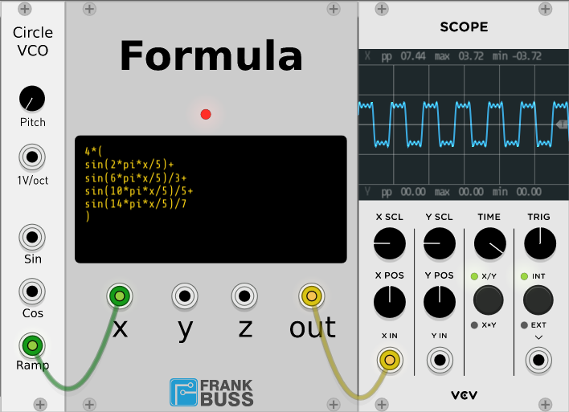

# Formula

A formula module for VCV Rack, by Frank Buss, based on BokontepByteBeatMachine.

This plugin provides 3 inputs: x, y and z. In the text field you can write a formula for the output.
E.g. x+y would be a simple adder. Also supported are a range of standard math functions, known from the C programming language:

acos, asin, atan, atan2, cos, cosh, exp, abs, mod, log, log10, pow, sin, sinh, tan, tanh, sqrt, ceil, floor, max, and min

And there is the constant pi defined. So if you feed a sawtooth with an amplitude from -5 to 5 to x, you will get a sine wave at the output
with the formula sin(2*pi*x/5)*5, as you can see here:

Some functions take 2 arguments. For example you could use the max function, to get either the input x or the input y, depending on which
voltage is higher: max(x, y).

The red LED is blinking if there is a parsing error. If it is on, the formula is running. To compile a formula, use the
context menu and the Initialize function, or the CTRL-I keyboard shortcut.
