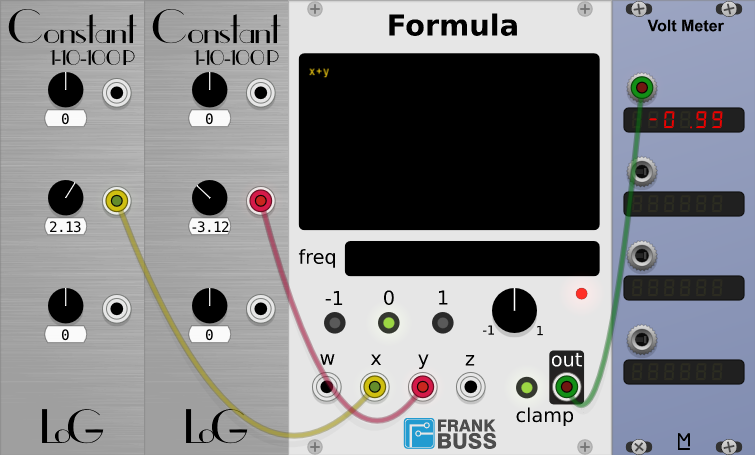
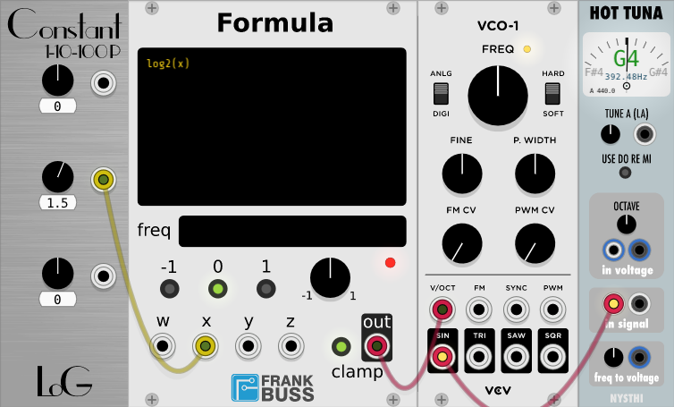
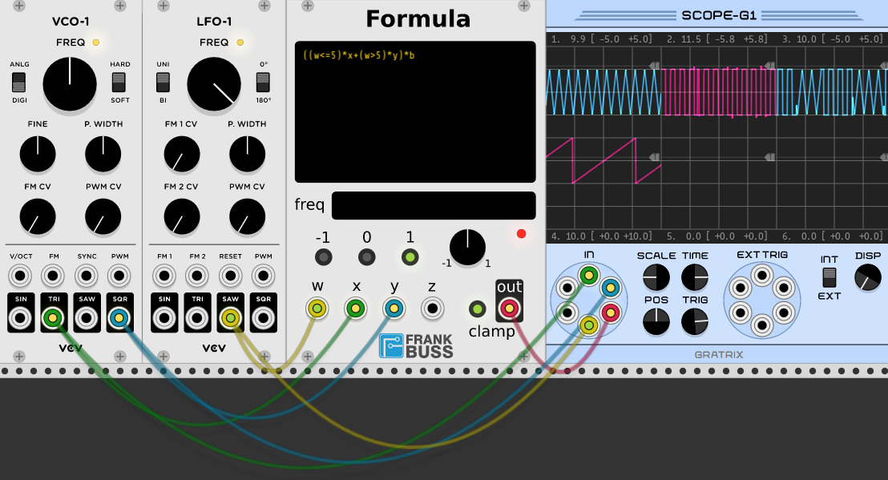
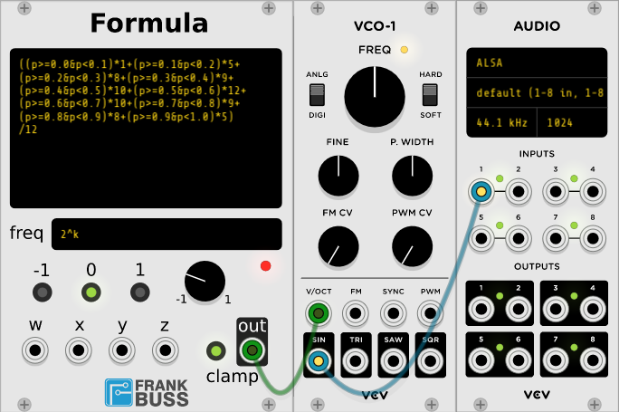
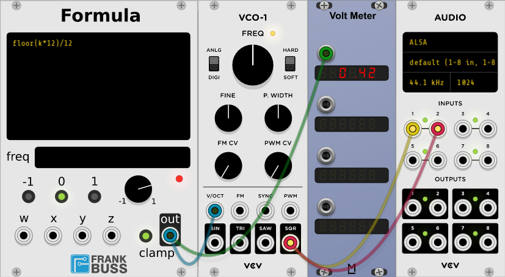

# Formula

A formula module for VCV Rack, by Frank Buss, based on BokontepByteBeatMachine.

This plugin provides 3 inputs: x, y and z. In the text field you can write a formula for the output.
For example `x+y` would be a simple adder.

Some functions take 2 arguments. For example you could use the max function, to get either the input x or the input y, depending on which
voltage is higher: `max(x, y)`.

The red LED is blinking if there is a parsing error. If it is on, the formula is running.



It works with CV and audio signals. The output is clamped to -5V/+5V. Some more examples for what you can use it:

# Waveform Generator

You can also use functions, see later for a list of all available functions, and you can use the variable
`pi`. In combination with a sawtooth, this can be used as a mathematically wave generator. The sawtooth
has to be a simple generator, with no aliasing, because the falling edge of the ramp needs to be with
no smoothing.

s-ol's Circle VCO is such an oscillator. It outputs a ramp from 0V to 5V at a frequency of 187.5 Hz, if the pitch
knob is at 0. So a sine wave with the usual 10Vpp can be generated with `sin(2*pi*x/5)*5`.

More complex formulas are possible as well, you can enter multiple lines. For example this
approximates the square wave function with additive synthesis with the base frequency and
the first 3 harmonics of the square wave:

```
4*(
sin(2*pi*x/5)+
sin(6*pi*x/5)/3+
sin(10*pi*x/5)/5+
sin(14*pi*x/5)/7
)
```


# Level Converter

Another wider range of applications is parameter adjustment. For example the VCO-1 in Fundamental
has a V/OCT input. This means when you create a new instance with the initial frequency for C4
(261.626 Hz) and apply 1 V, the frequency will be increased by one octave to C5 (523.252 Hz).

But what if you have a linear V/Hz CV signal and want to convert it in a way that it can be used with a V/OCT input? Then
you need to calculate the log to base 2 of the input level. There is only the log function to base e and base 10 available
in Formula, but with `log(x)/log(2)` you can calculate the signal. So for `x=1.5` it would be exactly
`1.5 * 261.626 Hz = 392.439 Hz`.



# Relational operators

The relational operators (<, >, <= and >=) allow other interesting applications. For example if you
want to select one of two signals, based on the CV level of another signal (a multiplexer). Then you could use
the formula `(z<=5)*x+(z>5)*y`. This would output x, if the level at the z input is 5V or less,
otherwise it outputs y. It works because if `z<=5` is valid, the term evaluates to 1, otherwise to 0.



# Boolean operators

Finally there are the boolean operators `&` for logical-and, `|` for logical-or and `!`for not.
This can be useful, if you want to test two signals with the relational operators,
like if x and y has some minimum value at the same time, only then output the value of z. Or you could
even use it to implement a 10 step sequencer with chromatic scale:

```
((x>=0 & x<1) * 1 + (x>=1 & x<2) * 5 +
(x>=2 & x<3) * 8 + (x>=3 & x<4) * 9 +
(x>=4 & x<5) * 10 + (x>=5 & x<6) * 12 +
(x>=6 & x<7) * 10 + (x>=7 & x<8) * 9 +
(x>=8 & x<9) * 8 + (x>=9 & x<10) * 5)
/ 12
```

Try it and listen to it, then change the factors interactively. Unlike a normal step
sequencer, you can adjust the length of the indivual steps as well by changing the
x time windows, lots of fun :-)



# Quantizer

You can use the `floor` function to implement a simple quantizer. This function rounds
the value down to the next integer value. For example `floor(1.8)=1`.
For a chromatic quantizer, only the voltages 0, 1/12, 2/12 etc. are allowed.
This can be enforced with this formula: `floor(x*12)/12`.



# The geeky details

The following functions are implemented:

acos, asin, atan, atan2, cos, cosh, exp, fabs, fmod, log, log10, pow, sin, sinh, tan, tanh, sqrt, ceil, floor, max, and min.
See here for a detailed description of each function: http://www.cplusplus.com/reference/cmath/

The full BNF grammar for the parser looks like this:

```
expression = and-expression [or-operator and-expression]
and-expression = equal-expression [and-operator equal-expression]
equal-expression = relational-expression [equal-operator relational-expression]
relational-expression = sum [relational-operator sum]
sum = [sign] term {additive-operator term}
term = factor {multiplicative-operator factor}
factor = power {power-operator power}
power = power_operand {power-operator power_operand}
power_operand = unsigned-real | variable | (expression) | function-call
or-operator = |
and-operator = &
equal-operator = == | !=
relational-operator = < | > | <= | >=
additive-operator = + | -
multiplicative-operator = * | / | %
power-operator = ^
not-operator = !
variable = [a-z, A-Z, _]+ [a-z, A-Z, 0-9, _]*
unsigned-real = [0-9]* [.] [0-9]* [real-exponent]
real-exponent = [e|E] [+|-] [0-9]+
```

I wrote the formula library in 2001, here is the original page with a function plotter as another example: http://www.frank-buss.de/formula/index.html
